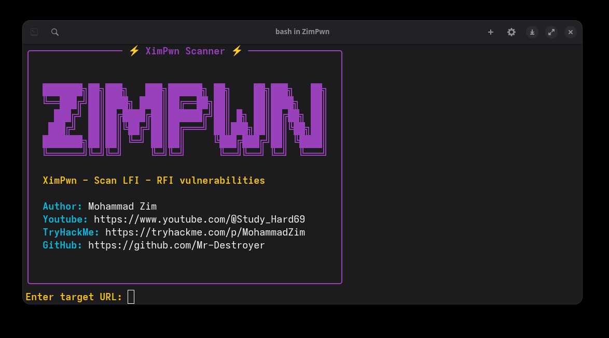
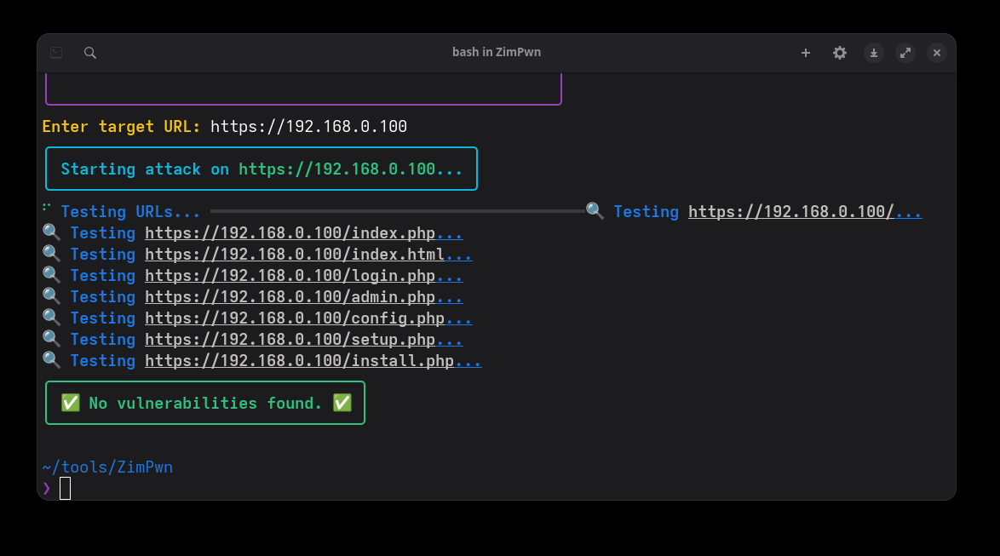
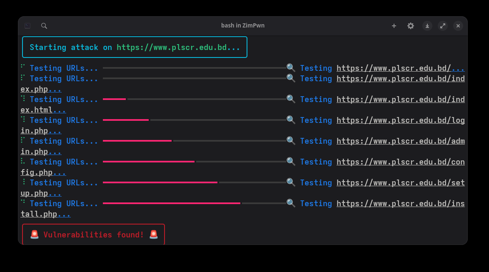
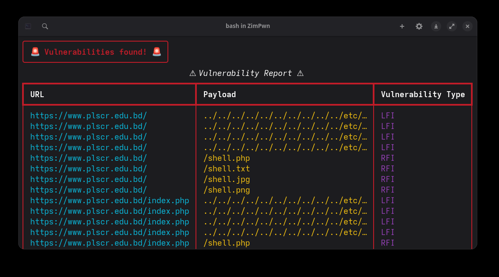

<h1 align="center">🔥 ZimPwn 🔥</h1>

<p align="center">
  
  
</p>

<p align="center">
  <b>A lightweight but powerful offensive-testing helper by <a href="https://github.com/Mr-Destroyer">Mohammad Zim</a></b>
</p>

---

## 🖥️ About  

`ZimPwn` is a proof-of-concept / penetration-testing helper script written in Python.  
It’s built for educational red-team labs and legal testing environments.  

Main files:  

- `pwn.py` — main script  
- `install.sh` — quick installer for requirements  

---






## How to install

```bash
# Clone the repo
git clone https://github.com/Mr-Destroyer/ZimPwn.git
cd ZimPwn

# Install requirements
chmod +x install.sh
./install.sh

# Run the script
python3 pwn.py
 
👤 Author
[*] Mohammad Zim (MrDestroyer)
[*] GitHub: github.com/Mr-Destroyer
[*] TryHackMe: tryhackme.com/p/MohammadZim
   YouTube: @Study_Hard69
⚠️ Legal Disclaimer

This project is for educational and authorized security testing only.
Any misuse of this tool is strictly discouraged. The author is not responsible for any damages or misuse.
 ```
